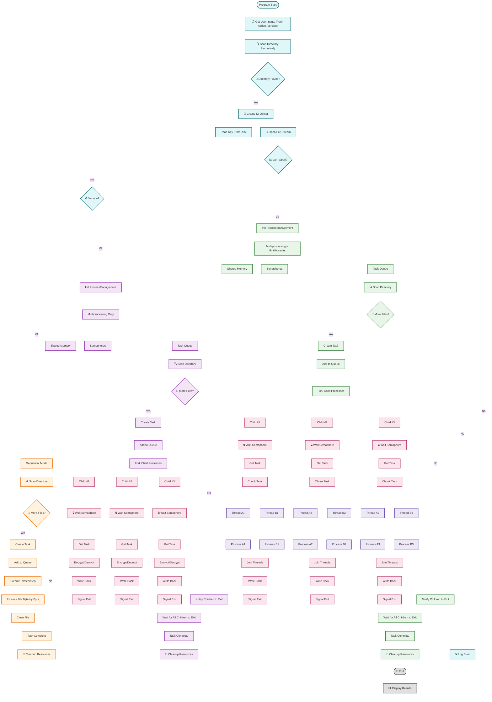

```mermaid
%%{init: {'theme': 'base', 'themeVariables': {'background': '#000000'}}}%%
flowchart TD
    %% ─────────────── Class Definitions ───────────────
    classDef common fill:#e0f7fa,stroke:#006064,stroke-width:2px;
    classDef v1 fill:#fff3e0,stroke:#ef6c00,stroke-width:2px;
    classDef v2 fill:#f3e5f5,stroke:#8e24aa,stroke-width:2px;
    classDef v3 fill:#e8f5e9,stroke:#2e7d32,stroke-width:2px;
    classDef child fill:#fce4ec,stroke:#ad1457,stroke-width:1.5px;
    classDef thread fill:#ede7f6,stroke:#4527a0,stroke-width:1.5px;
    classDef End fill:#e0e0e0,stroke:#424242,stroke-width:2px;

    %% ─────────────── Common Path ───────────────
    Start(["Program Start"]):::common --> Inputs["📋 Get User Inputs (Path, Action, Version)"]:::common
    Inputs --> Scan["🔍 Scan Directory Recursively"]:::common
    Scan --> FileCheck{"📁 Directory Found?"}:::common
    FileCheck -- Yes --> IO["📑 Create IO Object"]:::common
    FileCheck -- No --> End(["🏁 End"]):::End

    IO --> ReadEnv["Read Key From .env"]:::common
    IO --> Stream["📖 Open File Stream"]:::common
    Stream --> StreamCheck{"Stream Open?"}:::common
    StreamCheck -- Yes --> VersionCheck{"⚙️ Version?"}:::common
    StreamCheck -- No --> Log["❌ Log Error"]:::common
    Log --> End:::End

    %% ─────────────── V1: Sequential ───────────────
    VersionCheck -- V1 --> Seq1["Sequential Mode"]:::v1
    Seq1 --> Scan1["🔍 Scan Directory"]:::v1
    Scan1 --> FileCheck1{"📁 More Files?"}:::v1
    FileCheck1 -- Yes --> Task1["Create Task"]:::v1
    FileCheck1 -- No --> Done:::v1
    Task1 --> AddQueue1["Add to Queue"]:::v1
    AddQueue1 --> Immediate["Execute Immediately"]:::v1
    Immediate --> Process["Process File Byte-by-Byte"]:::v1
    Process --> Close["Close File"]:::v1
    Close --> Done["Task Complete"]:::v1
    Done --> Cleanup1["🧹 Cleanup Resources"]:::v1
    Cleanup1 --> End:::End

    %% ─────────────── V2: Multiprocessing ───────────────
    VersionCheck -- V2 --> Init2["Init ProcessManagement"]:::v2
    Init2 --> Multi2["Multiprocessing Only"]:::v2
    Multi2 --> Mem2["Shared Memory"]:::v2
    Multi2 --> Sem2["Semaphores"]:::v2
    Multi2 --> Queue2["Task Queue"]:::v2
    Queue2 --> Scan2["🔍 Scan Directory"]:::v2
    Scan2 --> FileCheck2{"📁 More Files?"}:::v2
    FileCheck2 -- Yes --> Task2["Create Task"]:::v2
    FileCheck2 -- No --> NotifyEnd2["Notify Children to Exit"]:::v2
    Task2 --> AddQueue2["Add to Queue"]:::v2
    AddQueue2 --> Fork2["Fork Child Processes"]:::v2

    Fork2 --> C2a["Child #1"]:::child
    Fork2 --> C2b["Child #2"]:::child
    Fork2 --> C2c["Child #3"]:::child

    C2a --> Wait2a["🔒 Wait Semaphore"]:::child --> Get2a["Get Task"]:::child --> Crypto2a["Encrypt/Decrypt"]:::child --> Write2a["Write Back"]:::child --> Exit2a["Signal Exit"]:::child
    C2b --> Wait2b["🔒 Wait Semaphore"]:::child --> Get2b["Get Task"]:::child --> Crypto2b["Encrypt/Decrypt"]:::child --> Write2b["Write Back"]:::child --> Exit2b["Signal Exit"]:::child
    C2c --> Wait2c["🔒 Wait Semaphore"]:::child --> Get2c["Get Task"]:::child --> Crypto2c["Encrypt/Decrypt"]:::child --> Write2c["Write Back"]:::child --> Exit2c["Signal Exit"]:::child

    NotifyEnd2 --> WaitExit2["Wait for All Children to Exit"]:::v2
    Exit2a --> WaitExit2
    Exit2b --> WaitExit2
    Exit2c --> WaitExit2
    WaitExit2 --> Done2["Task Complete"]:::v2
    Done2 --> Cleanup2["🧹 Cleanup Resources"]:::v2
    Cleanup2 --> End:::End

    %% ─────────────── V3: MultiProc + MultiThread ───────────────
    VersionCheck -- V3 --> Init3["Init ProcessManagement"]:::v3
    Init3 --> Multi3["Multiprocessing + Multithreading"]:::v3
    Multi3 --> Mem3["Shared Memory"]:::v3
    Multi3 --> Sem3["Semaphores"]:::v3
    Multi3 --> Queue3["Task Queue"]:::v3
    Queue3 --> Scan3["🔍 Scan Directory"]:::v3
    Scan3 --> FileCheck3{"📁 More Files?"}:::v3
    FileCheck3 -- Yes --> Task3["Create Task"]:::v3
    FileCheck3 -- No --> NotifyEnd3["Notify Children to Exit"]:::v3
    Task3 --> AddQueue3["Add to Queue"]:::v3
    AddQueue3 --> Fork3["Fork Child Processes"]:::v3

    Fork3 --> C3a["Child #1"]:::child
    Fork3 --> C3b["Child #2"]:::child
    Fork3 --> C3c["Child #3"]:::child

    %% Child #1 Threads
    C3a --> Wait3a["🔒 Wait Semaphore"]:::child --> Get3a["Get Task"]:::child --> Chunk3a["Chunk Task"]:::child
    Chunk3a --> T3a1["Thread A1"]:::thread --> P3a1["Process A1"]:::thread
    Chunk3a --> T3a2["Thread B1"]:::thread --> P3a2["Process B1"]:::thread
    P3a1 --> Join3a["Join Threads"]:::child
    P3a2 --> Join3a
    Join3a --> Write3a["Write Back"]:::child --> Exit3a["Signal Exit"]:::child

    %% Child #2 Threads
    C3b --> Wait3b["🔒 Wait Semaphore"]:::child --> Get3b["Get Task"]:::child --> Chunk3b["Chunk Task"]:::child
    Chunk3b --> T3b1["Thread A2"]:::thread --> P3b1["Process A2"]:::thread
    Chunk3b --> T3b2["Thread B2"]:::thread --> P3b2["Process B2"]:::thread
    P3b1 --> Join3b["Join Threads"]:::child
    P3b2 --> Join3b
    Join3b --> Write3b["Write Back"]:::child --> Exit3b["Signal Exit"]:::child

    %% Child #3 Threads
    C3c --> Wait3c["🔒 Wait Semaphore"]:::child --> Get3c["Get Task"]:::child --> Chunk3c["Chunk Task"]:::child
    Chunk3c --> T3c1["Thread A3"]:::thread --> P3c1["Process A3"]:::thread
    Chunk3c --> T3c2["Thread B3"]:::thread --> P3c2["Process B3"]:::thread
    P3c1 --> Join3c["Join Threads"]:::child
    P3c2 --> Join3c
    Join3c --> Write3c["Write Back"]:::child --> Exit3c["Signal Exit"]:::child

    NotifyEnd3 --> WaitExit3["Wait for All Children to Exit"]:::v3
    Exit3a --> WaitExit3
    Exit3b --> WaitExit3
    Exit3c --> WaitExit3
    WaitExit3 --> Done3["Task Complete"]:::v3
    Done3 --> Cleanup3["🧹 Cleanup Resources"]:::v3
    Cleanup3 --> End:::End

    End --> Results1["📊 Display Results"]:::End
```