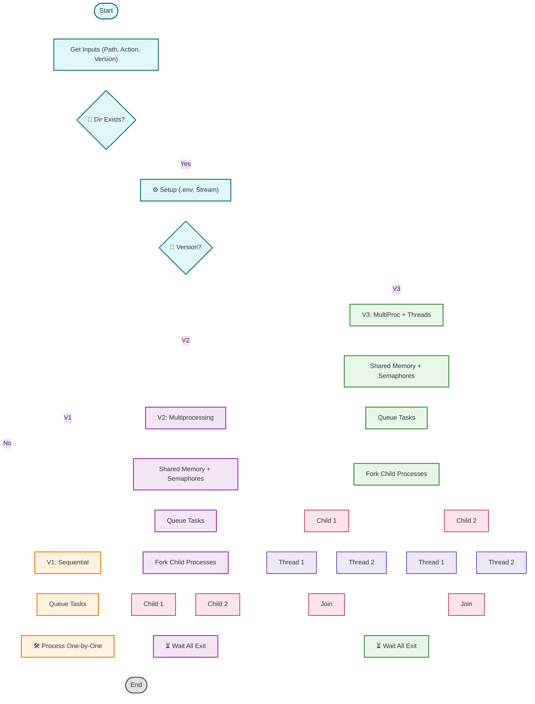

# 🔐 Encrypt-Decrypt
---
> A **high-performance** C++ system for encrypting and decrypting files, built with robust support for both **multiprocessing & multithreading**. Leveraging **shared memory and semaphores**, it seamlessly handles thousands of files in parallel — making it ideal for benchmarking and stress-testing concurrent file operations.
---

## 🚀 Features

* 🔄 **Encrypts and decrypts entire directories**
* ⚙️ **Supports Sequential, Multiprocessing, and Hybrid (MultiProcessing + MultiThreading) modes**
* 🧠 **Shared Memory** for efficient IPC + **Semaphores** for efficient process synchronization
* 📁 Handles **10,000+ files** with ease (auto-generated test cases)
* 🔑 Uses `.env` file to securely read the secret key
* 🧪 Python script to generate massive test datasets
* 📦 Build-ready with a single `Makefile`

---

## 📂 Project Structure

```
Encrypt-Decrypt/
├── main.cpp                    # Main entry point
├── Makefile                    # Build automation
├── makeDirs.py                 # Generates test files
├── src/
│   └── app/
│       ├── encryptDecrypt/
│       │   ├── Cryption.cpp   # Core encryption/decryption logic
│       │   ├── Cryption.hpp
│       │   └── CryptionMain.cpp
│       ├── fileHandling/
│       │   ├── IO.cpp         # File stream management
│       │   ├── IO.hpp
│       │   └── ReadEnv.cpp    # Reads key from .env file
│       └── processes/
│           ├── ProcessManagement.cpp  # Thread/Process manager
│           ├── ProcessManagement.hpp
│           └── Task.hpp       # Represents encryption/decryption task
```

---

## ⚙️ How It Works



---

## 📸 Performance Comparison

Benchmarked on a MacBook Air (M2, 8-core). Each mode was tested using 10,000 files of different sizes.

| Version | Method                      | Files  | Chars/File | Encryption (s) | Decryption (s) |
| ------- | --------------------------- | ------ | ---------- | -------------- | -------------- |
| V1      | Sequential (Baseline)       | 10,000 | 1,000      | 2.17448        | 2.09383        |
| V2      | Multiprocessing             | 10,000 | 1,000      | 1.44115        | 1.51795        |
| V3      | Multiprocessing + Threading | 10,000 | 1,000      | **0.264162**   | **0.258924**   |
| V1      | Sequential (Baseline)       | 10,000 | 10,000     | 22.3493        | 22.3638        |
| V2      | Multiprocessing             | 10,000 | 10,000     | 14.2879        | 16.8432        |
| V3      | Multiprocessing + Threading | 10,000 | 10,000     | **1.90524**    | **1.62334**    |
| V1      | Sequential (Baseline)       | 10,000 | 100,000    | ∞              | ∞              |
| V2      | Multiprocessing             | 10,000 | 100,000    | 131.125        | 132.205        |
| V3      | Multiprocessing + Threading | 10,000 | 100,000    | **1.72663**    | **2.30900**    |

> ✅ **Version 3 (Hybrid Multiprocessing + Threads)** outperforms all others, especially on large file sets.


---

## 🔧 Build Instructions

### Prerequisites

* `g++` with **C++17** support
* `Python 3` for test data generation

### Build the Project

```bash
make
```

### Generate Test Files

```bash
python3 makeDirs.py
```

---

## ▶️ Usage

```bash
./encrypt_decrypt
```

And follow the prompts:

```
Enter the directory path : test
Enter the action (encryption/decryption) : ENCRYPT/DECRYPT
Enter the version (V1/V2/V3) : 1/2/3
```

---

## 🔍 Internals Breakdown

| Component           | Purpose                                                         |
| ------------------- | --------------------------------------------------------------- |
| `Cryption`          | Byte-wise encryption/decryption logic                           |
| `ProcessManagement` | Manages process/thread spawning, synchronization via semaphores |
| `Task`              | Represents a unit of work for encryption/decryption             |
| `IO`                | Robust input/output file stream management                      |
| `ReadEnv`           | Parses `.env` to securely fetch the secret encryption key       |

---

## Example

Original `test1.txt`:

```
HelloWorld123
```

Encrypted with `KEY=5`:

```
MjqqtBtwqi678
```

---

## 💡 Fun Fact

The hybrid version (V3) can handle **10,000 files with 100,000 characters each** in **\~2 seconds**, thanks to intelligent use of **shared memory**, **child processes**, and **nested threads**.

---
